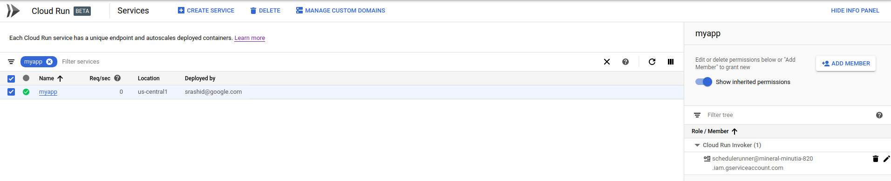

# Automatic OIDC:  Using Cloud Scheduler, Tasks, and PubSub to make authenticated calls to Cloud Run, Cloud Functions or your Server

This is a second in a series related to a versatile feature in [Cloud Scheduler](https://cloud.google.com/scheduler/docs/quickstart) and [Cloud Tasks](https://cloud.google.com/tasks/docs/dual-overview) and [Cloud PubSub](https://cloud.google.com/pubsub/docs/) that automatically emits google `OpenIDConnect` and `oauth2` `access_token` to  outbound webhook calls. When a Scheduled task fires and calls an HTTP endpoint, it can _automatically_ carry credentials to authenticate itself.  The `id_token` credential can then get validated at the HTTP web-hook target using well known techniques (i.,e validate the signature and `aud:` fields in the token).  Certain GCP services have built-in validation for this token and you can even apply IAM allow/deny policies for the user behind the token.


That is, this article focuses on (B) below, while the first part in the series is (A)

- A) oauth2 `access_tokens`
  - would allow you to directly call a Google Rest API endpoint
  - [https://developers.google.com/identity/protocols/OAuth2](https://developers.google.com/identity/protocols/OAuth2)

- B) Google-issued OpenID Connect `id_tokens`
  - would allow you to call any arbitrary endpoint which accepted an OpenID `id_token` in the payload.
  - [https://openid.net/specs/openid-connect-core-1_0.html#CodeIDToken](https://openid.net/specs/openid-connect-core-1_0.html#CodeIDToken)


For more information about the above two authentication systems, see:

* [Run Containers on GCP's Serverless Infrastructure (Cloud Next '19)](https://youtu.be/xVuuvZkYiNM?t=1546)

## Supported Services

### oauth2 (access_tokens)

- From Any of:

`[Cloud Scheduler, Cloud Tasks]`

  you can **emit** `access_token`

- to Any of:

`[ GCP REST API endopoint]`

### OIDC (id_tokens)

- From Any of:

`[ Cloud Scheduler, Cloud Tasks, Cloud PubSub* ]`

  you can **emit** `id_token`

- to Any of:

`[Cloud Run, Cloud Functions, Cloud Enpoints, Istio, {your application} ]`

Specific services like `Cloud Run`, `Cloud Functions` and `Cloud Endpoints` can automatically _validate_ the inbound `id_token` and check if it is properly signed by Google.  Furthermore, you can apply `IAM` policies for the user or service account associated with said token.  In other words, you can construct an IAM policy on `Cloud Run` that states "only allow _this_ service account access where that account is one associated with a `Cloud Scheduler` job.  For example, to secure `Cloud Run`, assign the IAM Role `roles/run.invoker` to the service behind the `id_token` (eg, Scheduler, Tasks or PubSub; as shown in the example in `Scheduler --> Cloud Run` below)


`PubSub` http_push targets are limited to [domain verification](https://cloud.google.com/pubsub/docs/push#domain_ownership_validation)

### Create Service Account

First setup a specific service account you wish to scheduler to invoke the endpoint as.  This is the service account that scheduler will run as and acquire the `id_token` **for**.  The section after this, we will apply IAM policies for this service account for `Cloud Scheduler`

Note:  Cloud Scheduler by default runs with a service account in the format `service-$PROJECT_NUMBER@gcp-sa-cloudscheduler.iam.gserviceaccount.com`

For other services:

* Cloud Scheduler:  service-$PROJECT_NUMBER@gcp-sa-cloudscheduler.iam.gserviceaccount.com
* Cloud Tasks:  service-$PROJECT_NUMBER@gcp-sa-cloudtasks.iam.gserviceaccount.com
* Cloud PubSub:  service-$PROJECT_NUMBER@gcp-sa-cloudpubsub.iam.gserviceaccount.com


I listed pubsub there for completeness but Pubsub only emits `oidc` tokens while `Scheduler` and `Tasks` can emit **BOTH** `oidc` and `oauth2`.  The followup article about `oidc` tokens demonstrates how to setup Pubsub

- Setup environment variables
```bash
export PROJECT_ID=`gcloud config get-value core/project`
export PROJECT_NUMBER=`gcloud projects describe $PROJECT_ID --format='value(projectNumber)'`
```

- Create Scheduler Service Account

```bash
gcloud iam service-accounts create schedulerunner --display-name="Task Schedule Runner"

$ gcloud iam service-accounts list
NAME                                      EMAIL                                                                       DISABLED
Task Schedule Runner                      schedulerunner@$PROJECT_ID.iam.gserviceaccount.com                  False
```

- Create an IAM Policy

This step will allow PubSub and Scheduler's service accounts to acquire a token _for_ `schedulerunner@$PROJECT_ID.iam.gserviceaccount.com`

 (remember to substitute your `PROJECT_NUMBER`)

- `svc_policy.json`:
```json
{
  "bindings": [
    {
      "members": [
        "serviceAccount:service-$PROJECT_NUMBER@gcp-sa-pubsub.iam.gserviceaccount.com"
      ],
      "role": "roles/iam.serviceAccountTokenCreator"
    },
    {
      "members": [
        "serviceAccount:service-$PROJECT_NUMBER@gcp-sa-cloudscheduler.iam.gserviceaccount.com"
      ],
      "role": "roles/cloudscheduler.serviceAgent"
    }    
  ],
}
```

- Apply Policy file so Scheduler can impersonate

```bash
$ gcloud iam service-accounts set-iam-policy schedulerunner@$PROJECT_ID.iam.gserviceaccount.com  svc_policy.json  -q
```


## OIDC

The specific `gcloud` commands for `Scheduler` and `PubSub` to *emit* `oidc` tokens:

- Cloud Scheduler

```bash
gcloud beta scheduler jobs create http
          | [--oidc-service-account-email=OIDC_SERVICE_ACCOUNT_EMAIL
          : --oidc-token-audience=OIDC_TOKEN_AUDIENCE]] [GCLOUD_WIDE_FLAG ...]
```

- Cloud PubSub

```bash
gcloud alpha pubsub subscriptions create SUBSCRIPTION
        [--push-auth-service-account=SERVICE_ACCOUNT_EMAIL]
        [--push-auth-token-audience=OPTIONAL_AUDIENCE_OVERRIDE]
```

While on the validation, you can configure GCF to _accept_ an `oidc` token:

- Cloud Functions

```bash
gcloud functions add-iam-policy-binding $FUNCTION_NAME \
  --member serviceAccount:$SERVICE_ACCOUNT_A_EMAIL \
  --role roles/cloudfunctions.invoker
```

### OIDC Audience

A bit about the `audience:` field in OIDC tokens.

You must set this field for the invoking service and specify the fully qualified URL of the receiving service.  For example, if you are invoking `Cloud Run` or `Cloud Functions`, the `id_token` must include the URL/path of the service.


```json
{
  "aud": "https://uri-of-intended-service",
  "azp": "107145139691231222712",
  "email": "service-$PROJECT_NUMBER@gcp-sa-cloudscheduler.iam.gserviceaccount.com",
  "email_verified": true,
  "exp": 1556665461,
  "iat": 1556661861,
  "iss": "https://accounts.google.com",
  "sub": "107145139691231222712"
}
```

If the target is your own application endpoint, you must validate the inbound `id_token`.  The appendix section shows token validation in python and envoy proxy.


---

Ok, now to the tests,


### PubSub --> Cloud Run

In the first set of samples, we will integrate `PubSub` and `Cloud Scheduler` with `Cloud Run`

setup a sample `Cloud Run` Application with authentication enabled:

```bash
gcloud beta run deploy hello --image gcr.io/cloudrun/hello  --region=us-central1  -q

Service [hello] revision [hello-00001] has been deployed and is serving traffic at https://hello-6w42z6vi3q-uc.a.run.app
```

Which means we need to add the originating serivce accounts (for PubSub and Scheduler) into `roles/run.Invoker`:

 


Now deploy a PubSub push notificatoin target.  Remember to set the audience to the URL of the Run instance

```
gcloud alpha pubsub topics create runtopic

gcloud alpha pubsub subscriptions create psub --topic runtopic \
  --push-endpoint https://hello-6w42z6vi3q-uc.a.run.app \
  --push-auth-service-account=schedulerunner@$PROJECT_ID.iam.gserviceaccount.com \
  --push-auth-token-audience=https://hello-6w42z6vi3q-uc.a.run.app
```

Publish a message

```
gcloud alpha pubsub  topics publish runtopic --message='hello world'
```

See invocation on `Cloud Run`:


### Scheduler --> Cloud Run

Similar to the above, invoke Cloud Run using a Scheduled Job

```bash
gcloud beta scheduler jobs create http oidctest  --schedule "5 * * * *" --http-method=GET \
  --uri=https://hello-6w42z6vi3q-uc.a.run.app \
  --oidc-service-account-email=schedulerunner@$PROJECT_ID.iam.gserviceaccount.com    \
  --oidc-token-audience=https://hello-6w42z6vi3q-uc.a.run.app
```


For the impatient, invoke the scheduled job now

```
gcloud beta scheduler jobs run oidctest
```

Check logs In `Cloud Run`:


And corresponding in `Cloud Scheduler`:


### Scheduler --> Cloud Functions

First lets setup a receiving cloud function with authentication

- main.py:
```python
def hello_http(request):
    request_json = request.get_json(silent=True)
    request_args = request.args
    return 'Hello World!'

```

- Deploy
```
gcloud functions deploy  authfn --entry-point=hello_http --trigger-http --runtime=python37

    entryPoint: hello_http
    name: authfn
    httpsTrigger:
      url: https://us-central1-$PROJECT_ID.cloudfunctions.net/authfn
    name: projects/$PROJECT_ID/locations/us-central1/functions/authfn
```

> Note the `url`, we will use this later while defining the endpoints

- Apply security [bit.ly/gcf-iam-alpha](bit.ly/gcf-iam-alpha))

```
gcloud alpha functions add-iam-policy-binding authfn \
  --member serviceAccount:schedulerunner@$PROJECT_ID.iam.gserviceaccount.com \
  --role roles/cloudfunctions.invoker
```


- Deploy Scheduled Task

```
gcloud beta scheduler jobs create http gcftest  --schedule "5 * * * *" --http-method=GET \
  --uri=https://us-central1-$PROJECT_ID.cloudfunctions.net/authfn \
  --oidc-service-account-email=schedulerunner@$PROJECT_ID.iam.gserviceaccount.com    \
  --oidc-token-audience=https://us-central1-$PROJECT_ID.cloudfunctions.net/authfn
```

```
gcloud beta scheduler jobs run gcftest
```

Then on the Scheduler logs:


On GCF Logs


### Cloud PubSub --> Cloud Functions

As of `5/18/19`, PubSub does **NOT** allow registration of push endpoints to arbitrary http targets

```
gcloud alpha pubsub subscriptions create psubgcf --topic runtopic \
  --push-endpoint https://us-central1-$PROJECT_ID.cloudfunctions.net/authfn \
  --push-auth-service-account=schedulerunner@$PROJECT_ID.iam.gserviceaccount.com \
  --push-auth-token-audience=https://us-central1-$PROJECT_ID.cloudfunctions.net/authfn
```
gives
```
ERROR: Failed to create subscription [projects/@$PROJECT_ID/subscriptions/psubgcf]: The supplied HTTP URL is not registered in the subscription's parent project (url="https://us-central1-@$PROJECT_ID.cloudfunctions.net/authfn", project_id="....").
```

The domain `.coudfunctions.net` is not under a whitelist that allowed the earlier `PubSub` -> `CLoud Run`  integration (i.,e an http target of`run.net` is whitelisted in PubSub).

* This will be addressed on GCP where you can whitelist `cloudfunctions.net` domain.
* Wokraround would be to setup [custom domains](https://cloud.google.com/pubsub/docs/push#domain_ownership_validation) for GCF (via Firebase Functions/hosting)

### Scheduler --> { your application }

Emitting an OIDC token from any of the above to _your_ application is pretty much the same.  Specify the URL, audience during configuration and make sure the remote service you are running accepts https (and is not self-signed).

You can use the Python sample or Envoy to validate the token (see appendix below)


```bash
gcloud beta scheduler jobs create http apptest  --schedule "5 * * * *" --http-method=GET \
  --uri=https://your_app_url \
  --oidc-service-account-email=schedulerunner@$PROJECT_ID.iam.gserviceaccount.com    \
  --oidc-token-audience=https://your_app_url
```

> NOTE: your remote server mush have a valid SSL certificate and cannot be self-signed.


### Cloud Task --> Cloud Run

I don't have a sample handy but here is golang app that enqueues a `Task` that carries an `oidc` token:

- [CloudTasks.go](https://gist.github.com/salrashid123/332fa64074b0bd40a9786af95b4e0b4b)

```golang
	location := "us-central1"
	parent := "projects/" + projectID + "/locations/" + location + "/queues/" + queueName
	taskName := parent + "/tasks/" + randTaskID

	req := &taskspb.CreateTaskRequest{
		Parent: parent,
		Task: &taskspb.Task{
			Name: taskName,
			PayloadType: &taskspb.Task_HttpRequest{
				HttpRequest: &taskspb.HttpRequest{
					Url:        "https://hello-6w42z6vi3q-uc.a.run.app",
					HttpMethod: taskspb.HttpMethod_GET,
					AuthorizationHeader: &taskspb.HttpRequest_OidcToken{
						OidcToken: &taskspb.OidcToken{
							ServiceAccountEmail: "schedulerunner@$PROJECT_ID.iam.gserviceaccount.com",
							Audience:            "https://hello-6w42z6vi3q-uc.a.run.app",
						},
					},
				},
			},
		},
	}
	resp, err := c.CreateTask(ctx, req)
	if err != nil {
		log.Fatalf("ERROR: ", err.Error())
	}
```

#### OIDC Verification

```python
from google.oauth2 import id_token
import google.auth
import google.auth.transport.requests

target_audience = 'https://myapp-6w42z6vi3q-uc.a.run.app'
certs_url='https://www.googleapis.com/oauth2/v1/certs'

idt='<YOURIDTOKEN>'

request = google.auth.transport.requests.Request()
print id_token.verify_token(idt,request,certs_url=certs_url)
```

#### OIDC Creation

- Service Account

```python
from google.oauth2 import id_token
from google.oauth2 import service_account
import google.auth
import google.auth.transport.requests
from google.auth.transport.requests import AuthorizedSession

target_audience = 'https://myapp-6w42z6vi3q-uc.a.run.app'
url = 'https://myapp-6w42z6vi3q-uc.a.run.app'
certs_url='https://www.googleapis.com/oauth2/v1/certs'

additional_claims = { }

creds = service_account.IDTokenCredentials.from_service_account_file(
        '/path/to/svc_account.json',
        target_audience= target_audience, additional_claims=additional_claims)

authed_session = AuthorizedSession(creds)

# make authenticated request
r = authed_session.get(url)
print r.status_code
print r.text
```

- GCE|GKE|GCF|Run

```python
from google.oauth2 import id_token
from google.auth import compute_engine
import google.auth
import google.auth.transport.requests
from google.auth.transport.requests import AuthorizedSession
from google.oauth2.credentials import Credentials
import requests

target_audience = 'https://myapp-6w42z6vi3q-uc.a.run.app'
url = 'https://myapp-6w42z6vi3q-uc.a.run.app'
certs_url='https://www.googleapis.com/oauth2/v1/certs'
metadata_url = "http://metadata/computeMetadata/v1/instance/service-accounts/default/identity?audience=" + target_audience

r = requests.get(metadata_url, headers={"Metadata-Flavor":"Google"})

idt=''
creds = google.oauth2.credentials.Credentials(idt)
authed_session = AuthorizedSession(creds)

# make authenticated request
r = authed_session.get(url)

print r.status_code
print r.text
```

#### Envoy

- [Envoy Google OIDC](https://github.com/salrashid123/envoy_iap/blob/master/envoy_google.yaml)

Sample usage using gcloud's own client_id.  Use this just for testing!

```bash
export ID_TOKEN=$(gcloud config config-helper --format 'value(credential.id_token)')

curl -H "Authorization: Bearer $ID_TOKEN" http://localhost:10000/```
```
